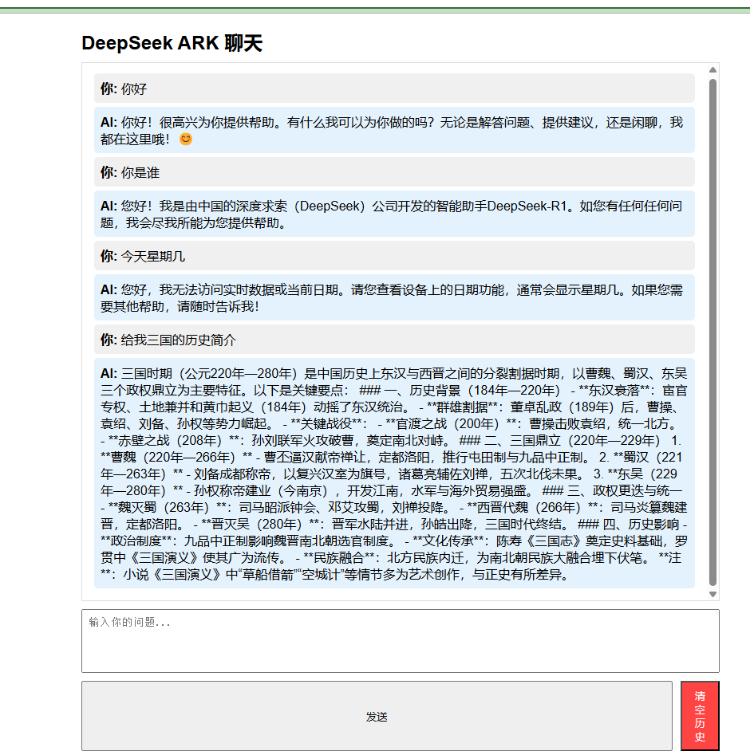

# DeepSeek ARK 聊天应用

一个基于网页的聊天应用，集成了 DeepSeek ARK 的 AI 模型，提供交互式对话响应。

## 功能特点

- 实时流式聊天响应
- 清晰直观的网页界面
- 使用本地存储的聊天历史管理
- 键盘快捷键支持（Ctrl + Enter 发送）
- 错误处理和状态反馈

## 环境要求

- Python 3.x
- Flask web 框架
- OpenAI Python 客户端库
- DeepSeek ARK API 密钥

## 安装步骤
1. 克隆仓库或下载源代码
2. 安装所需的 Python 包：
```bash
pip install flask openai python-dotenv
```

3. 配置您的 DeepSeek ARK API 凭证：
   - 创建 `config.py` 文件并设置您的 API 密钥：
   ```python
   DEEPSEEK_API_KEY = "your_api_key"
   ```
   - 确保将 `config.py` 添加到 `.gitignore` 以避免泄露密钥
   - 也可以使用环境变量以提高安全性

## 配置说明

应用使用以下配置：

- 默认端口：8888（可通过命令行参数配置）
- API 基础 URL：https://ark.cn-beijing.volces.com/api/v3
- 模型：deepseek-r1-250120

## 使用方法

1. 启动服务器：
```bash
python app.py
```

2. 访问网页界面：
   - 在浏览器中访问 `http://localhost:8888`
   - 界面将自动加载

3. 使用聊天界面：
   - 在输入框中输入您的消息
   - 点击"发送"或按 Ctrl + Enter 发送消息
   - 实时查看 AI 的流式响应
   - 使用"清除历史"按钮重置聊天

## 项目结构

- `app.py`：主要的 Flask 应用服务器
- `config.py`：配置文件，存储 API 密钥等敏感信息
- `static/index.html`：网页界面
- `test_api.py`：API 测试脚本

## 功能详情
